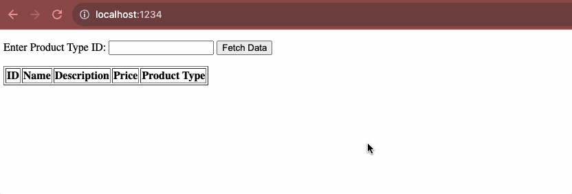

# Instructions

Please create a Javascript function that has a parameter `productType`, upon executing this function, it should: retrieve data from `sample.com/products`, and `sample.com/producttypes`. Consider that upon retrieving you might have to deal with race conditions.

## Final result

  

## Requirements

1. Node v18 or higher
1. Yarn v1.12 or higher

## Getting started

We are using the [Workspaces](https://classic.yarnpkg.com/lang/en/docs/workspaces/) feature of Yarn to concurrently invoke both a front- and back-end for this exercise.

Run:

    yarn && yarn start

Then, visit `http://localhost:1234`.

## Notes from author

- I could have used the native `fetch` command, but I'm more used to `axios`. Hoping you are okay with that compromise. 
- I used Volta as my Node version & package manager, but this setup should work whether or not you have Volta installed.
